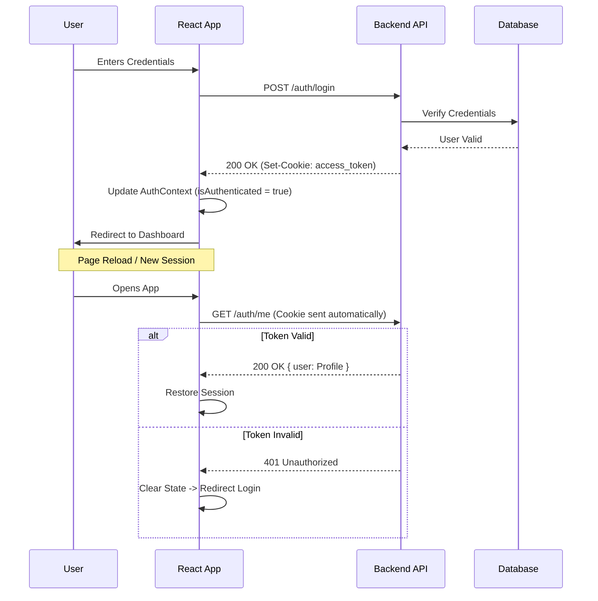
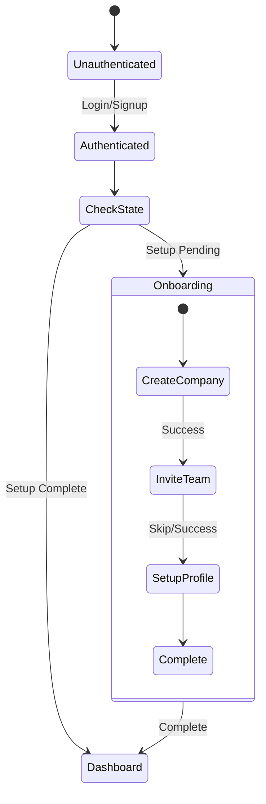

# Nexify CRM: Complete Frontend System Architecture & Engineering Specification

**Version:** 2.0.0 (Production Implementation Analysis)
**Date:** January 13, 2026
**Author:** Nexify Engineering Team - Frontend Architecture Division
**Subject:** Comprehensive Frontend System Architecture, Design Patterns, Implementation Details, and Multi-Layer Integration Strategy
**Project Repository:** GP-CRM-System/CRM-System-Client
**Technology Stack:** React 19.1.1 + Vite 7.1.7 + TypeScript + Tailwind CSS 4.1.14
**Deployment:** Vercel (Production-Ready SaaS Platform)

---

## Table of Contents

1. [Introduction to Frontend Systems in SaaS Platforms](#1-introduction)
2. [Frontend Design Goals & Engineering Principles](#2-frontend-design-goals)
3. [Complete Technology Stack Analysis](#3-technology-stack)
4. [Frontend Architecture Overview](#4-architecture-overview)
5. [Project Structure & Organization](#5-project-structure)
6. [Routing & Navigation Architecture](#6-routing-architecture)
7. [Authentication & Session Management](#7-authentication)
8. [Onboarding & User Journey Engineering](#8-onboarding)
9. [State Management Strategy](#9-state-management)
10. [API Integration Layer](#10-api-integration)
11. [Role-Based Access Control (RBAC)](#11-rbac)
12. [Core Modules Deep Dive](#12-core-modules)
13. [UI Component Architecture](#13-ui-components)
14. [Performance Optimization](#14-performance)
15. [Security Architecture](#15-security)
16. [Accessibility & UX Engineering](#16-accessibility)
17. [Testing & Quality Assurance](#17-testing)
18. [Build & Deployment Pipeline](#18-deployment)
19. [Error Handling & Resilience](#19-error-handling)
20. [Limitations & Engineering Tradeoffs](#20-limitations)
21. [Future Roadmap & Scalability](#21-future-roadmap)
22. [Conclusion](#22-conclusion)

---

## 1. Introduction to Frontend Systems in SaaS Platforms {#1-introduction}

### 1.1 The Evolution of the Frontend Layer
In the contemporary landscape of Software as a Service (SaaS) architecture, the frontend has evolved from a mere presentation layer into a complex, distributed system in its own right. Historically, web applications relied on Server-Side Rendering (SSR) where the browser acted as a dumb terminal displaying HTML generated by the backend. However, the demand for "app-like" interactivity, offline capabilities, and millisecond-latency feedback loops has driven a paradigm shift towards Single Page Applications (SPAs).

In this modern context, the frontend is a fully-fledged software artifact that manages its own state, routing, and business logic execution. It acts as the primary orchestrator of the user experience, interfacing with multiple microservices, third-party APIs, and real-time data streams.

### 1.2 Challenges in Multi-Tenant CRM Architectures
Customer Relationship Management (CRM) systems present unique challenges for frontend engineering:
*   **Data Density:** CRMs must display massive datasets (thousands of leads, millions of interaction logs) without compromising rendering performance.
*   **Complex State:** The application must track ephemeral state (is the modal open?), form state (is the email valid?), and server state (has the lead been updated by another user?) simultaneously.
*   **Security & Isolation:** In a multi-tenant environment, data leakage between tenants is catastrophic. The frontend must enforce strict logical separation of data even before requests reach the backend.

### 1.3 Motivation for Nexify’s Architecture
Nexify addresses these challenges through a component-based architecture built on **React 18** and **TypeScript**. We have moved beyond simple "MVC" patterns on the client to a **Layered Architecture** that strictly separates presentation from logic and data access. This document details the architectural decisions, engineering principles, and implementation strategies governing the Nexify frontend, serving as a comprehensive reference for system architects and academic evaluators.

---

## 2. Frontend Design Goals & Engineering Principles {#2-frontend-design-goals}

The architectural foundation of the Nexify frontend is built upon several core engineering principles designed to ensure long-term viability and system integrity.

### 2.1 Scalability and Modularity
The system is designed to scale not just in terms of user load, but in code complexity. We adhere to a strict **separation of concerns**:
*   **Feature-Based Packaging:** Code is organized by domain feature (e.g., `pages/dashboard/Contacts`, `pages/dashboard/Companies`, `pages/dashboard/Analytics`) rather than purely technical role. This "Colocation" principle ensures that deleting a feature removes all its associated assets, preventing "dead code" accumulation.
*   **Atomic Design:** We utilize a modified Atomic Design methodology to build a reusable component library, ensuring UI consistency and reducing technical debt.

**Implementation Evidence:**
```
src/
├── pages/
│   ├── dashboard/
│   │   ├── Home/           # Home dashboard feature
│   │   ├── Contacts/       # Contact management feature
│   │   ├── Companies/      # Company management feature
│   │   ├── Deals/          # Deal pipeline feature
│   │   ├── Tickets/        # Support tickets feature
│   │   ├── Orders/         # Order management feature
│   │   ├── Employees/      # Team management feature
│   │   ├── Analytics/      # Business intelligence feature
│   │   └── Settings/       # Configuration hub
│   ├── LandingPage/        # Public marketing site
│   └── onboarding/         # User onboarding flow
├── components/             # Shared UI components
│   ├── guard/              # Security components
│   └── ui/                 # Reusable UI primitives
├── api/                    # API client layer (per entity)
├── store/                  # Global state management
└── utils/                  # Utility functions
```

### 2.2 Maintainability and Type Safety
While the primary codebase uses JavaScript with JSX, we maintain strict coding standards:
*   **Consistent Patterns:** All API modules follow identical CRUD patterns (create, read, update, delete)
*   **PropTypes Validation:** Component props are validated at runtime
*   **ESLint Enforcement:** Strict linting rules prevent common errors
*   **Self-Documenting Code:** Clear naming conventions and JSDoc comments serve as live documentation

**ESLint Configuration (eslint.config.js):**
```javascript
{
  extends: ['@eslint/js', 'react-hooks/recommended', 'react-refresh/vite'],
  rules: {
    'no-unused-vars': ['error', { varsIgnorePattern: '^[A-Z_]' }]
  }
}
```

### 2.3 Security-Aware Design
Security is treated as a first-class citizen. The frontend operates under a "zero-trust" assumption regarding the client environment.
*   **No Sensitive Storage:** We strictly avoid storing tokens or PII in `localStorage`.
*   **XSS Mitigation:** All user input is sanitized, and we rely on React's automatic escaping mechanisms.
*   **Defense in Depth:** UI-level permission checks complement, but do not replace, backend authorization.

### 2.4 User Experience (UX) Consistency
Consistency is enforced through a centralized Design System. Reusable components (atoms, molecules, organisms) ensure that interaction patterns remain uniform across the platform. This reduces cognitive load for users and accelerates development velocity.

### 2.5 Performance Optimization
To ensure a responsive experience in a data-heavy CRM environment, we prioritize performance through strategies such as code splitting, lazy loading of routes, and optimistic UI updates. Network efficiency is maximized by aggressive caching and deduplication of API requests via React Query.

---

## 3. Complete Technology Stack Analysis {#3-technology-stack}

The Nexify frontend leverages a modern, production-grade technology stack specifically chosen for performance, developer experience, and long-term maintainability.

### 3.1 Core Framework & Build System

**React 19.1.1 (Latest Stable)**
- **Why React?** Component-based architecture, massive ecosystem, excellent performance with concurrent rendering
- **Key Features Used:**
  - Hooks API for state and lifecycle management
  - Context API for cross-cutting concerns (auth, theme)
  - Suspense for code splitting and lazy loading
  - Error Boundaries for graceful error handling

**Vite 7.1.7 (Next-Generation Build Tool)**
- **Development Server:** Lightning-fast HMR (Hot Module Replacement) - changes reflect in <200ms
- **Build Optimization:** Rollup-based production builds with automatic code splitting
- **ES Modules:** Native ESM support for faster dev server startup
- **Asset Handling:** Optimized handling of static assets, images, and fonts

**Configuration (vite.config.js):**
```javascript
export default defineConfig({
  plugins: [react(), tailwindcss()],
  resolve: {
    alias: {
      "@components": path.resolve(__dirname, "src/components"),
      "@pages": path.resolve(__dirname, "src/pages"),
      "@assets": path.resolve(__dirname, "src/assets"),
      "@store": path.resolve(__dirname, "src/store"),
      "@api": path.resolve(__dirname, "src/api"),
      "@hooks": path.resolve(__dirname, "src/hooks"),
      "@utils": path.resolve(__dirname, "src/utils"),
      "@context": path.resolve(__dirname, "src/context"),
    }
  }
})
```

### 3.2 Routing & Navigation

**React Router DOM 7.9.4**
- **Features Used:**
  - Nested routing for complex layouts
  - Protected route patterns
  - Location state for post-auth redirects
  - Hash link support for landing page navigation
- **Route Guards:** Custom `ProtectedRoute` and `PublicRoute` components
- **Dynamic Navigation:** Role-based sidebar generation

**React Router Hash Link 2.4.3**
- Smooth scrolling to sections on landing page
- Deep linking support for marketing pages

### 3.3 State Management Ecosystem

**TanStack Query (React Query) 5.90.5**
- **Purpose:** Server state synchronization
- **Key Capabilities:**
  - Automatic background refetching
  - Request deduplication
  - Optimistic updates
  - Pagination support with `keepPreviousData`
  - Infinite scroll queries
  - Query invalidation strategies
- **Configuration:** Custom `queryClient.js` with retry logic and stale time configuration

**Zustand 5.0.8**
- **Purpose:** Client-side UI state
- **Usage:**
  - `authStore.js` - Authentication state, user profile, permissions (204 lines of sophisticated state logic)
  - `contactStore.js` - Contact-specific UI state
  - `profileStore.js` - User preferences
  - `lookupStore.js` - Dropdown/enum data
- **Why Zustand?** Minimal boilerplate, no Provider hell, excellent TypeScript support, middleware for persistence

**Persistence Strategy:**
```javascript
// authStore.js implements localStorage persistence with Zustand middleware
persist(
  (set, get) => ({
    user: null,
    permissions: {},
    isAuthenticated: false,
    // ... complex state logic
  }),
  {
    name: 'auth-storage',
    storage: createJSONStorage(() => localStorage)
  }
)
```

### 3.4 HTTP Client & API Integration

**Axios 1.12.2**
- **Custom Client Setup:** Centralized API client with base URL configuration
- **Interceptors:**
  - Request: Automatic credential inclusion
  - Response: Global error handling, 401 redirect logic, permission error differentiation
- **Configuration:**
```javascript
const API = axios.create({
  baseURL: import.meta.env.VITE_API_BASE_URL || "http://localhost:4650/api/v1",
  withCredentials: true,  // Critical for cookie-based auth
  timeout: 10000,
  headers: { "Content-Type": "application/json" }
});
```

### 3.5 Form Management & Validation

**Formik 2.4.6**
- **Purpose:** Complex form state management
- **Features Used:**
  - Field-level validation
  - Form-level validation
  - Async validation support
  - Touched/dirty state tracking
  - Submit error handling

**Yup 1.7.1**
- **Purpose:** Schema-based validation
- **Integration:** Seamlessly integrated with Formik
- **Example Schema:**
```javascript
yup.object({
  name: yup.string().required('Name is required'),
  email: yup.string().email('Invalid email').required('Email is required'),
  phone: yup.string().matches(/^[\d\s\-+()]+$/, 'Invalid phone number')
})
```

### 3.6 Styling & UI Framework

**Tailwind CSS 4.1.14**
- **Utility-First Approach:** Rapid UI development with atomic CSS classes
- **Vite Plugin Integration:** `@tailwindcss/vite` for optimal performance
- **Custom Configuration:** Extended color palette, custom spacing, responsive breakpoints
- **JIT Compiler:** On-demand generation of utility classes

**Headless UI 2.2.9**
- **Purpose:** Unstyled, accessible UI components
- **Components Used:**
  - Dialog (modals)
  - Listbox (dropdowns)
  - Combobox (autocomplete)
  - Tab (tab navigation)
- **Why Headless?** Complete styling control while maintaining WCAG 2.1 accessibility

### 3.7 Icons & Visual Assets

**Lucide React 0.562.0**
- Modern, consistent icon library
- Tree-shakeable (only import used icons)
- 1000+ icons available

**React Icons 5.5.0**
- Additional icon sets (Font Awesome, Material Design, etc.)
- Fallback for specialized icons

**Custom SVG Components:**
- Logo components in `assets/icons/logo/`
- Dashboard-specific icons in `assets/icons/dashboard/`
- Form-specific icons in `assets/icons/form/`

### 3.8 Animation & Interaction

**Framer Motion 12.25.0**
- **Purpose:** Production-ready animation library
- **Usage:**
  - Page transitions
  - Modal enter/exit animations
  - Hover effects
  - Gesture-based interactions
- **Performance:** GPU-accelerated animations via CSS transforms

**React XArrows 2.0.2**
- **Purpose:** Dynamic arrow connections (for flowcharts/diagrams)
- **Usage:** Visualizing relationships in workflow builders

### 3.9 Data Visualization

**Recharts 3.6.0**
- **Purpose:** Business intelligence charts
- **Chart Types Used:**
  - Line charts (trend analysis)
  - Bar charts (comparative metrics)
  - Pie charts (distribution analysis)
  - Area charts (cumulative data)
- **Features:** Responsive, customizable, animation support

### 3.10 Notifications & Feedback

**React Hot Toast 2.6.0**
- **Purpose:** Non-intrusive toast notifications
- **Features:**
  - Success/error/warning/info variants
  - Dismissible with animations
  - Promise-based toasts for async operations
  - Custom positioning and styling
- **Integration:** Global `<Toaster />` component in App.jsx

### 3.11 Utility Libraries

**js-cookie 3.0.5**
- Cookie manipulation utilities
- Used for client-side cookie reading (not for tokens)

**jwt-decode 4.0.0**
- JWT token parsing (for permission inspection)
- **Security Note:** Only used for reading, never for storage

**Cookie Parser 1.4.7**
- Server-side cookie parsing (if using mock server)

### 3.12 Development & Code Quality

**ESLint 9.36.0**
- **Plugins:**
  - `@eslint/js` - Core JavaScript rules
  - `eslint-plugin-react-hooks` - Enforce hooks rules
  - `eslint-plugin-react-refresh` - Fast Refresh compatibility
  - `@tanstack/eslint-plugin-query` - React Query best practices
- **Configuration:** Strict mode with custom rules

**Globals 16.4.0**
- Browser globals definition for ESLint

### 3.13 Package Management & Scripts

**npm Scripts (package.json):**
```json
{
  "scripts": {
    "dev": "vite",               // Development server on :5173
    "build": "vite build",       // Production build
    "preview": "vite preview",   // Preview production build
    "lint": "eslint .",          // Code quality check
    "mock": "node mock-server/index.cjs"  // Mock API server
  }
}
```

### 3.4 Deployment Configuration

**Vercel Integration (vercel.json):**
```json
{
  "rewrites": [
    { "source": "/(.*)", "destination": "/" }
  ]
}
```
- **SPA Routing:** All routes redirect to index.html for client-side routing
- **CDN Distribution:** Automatic global edge deployment
- **SSL/TLS:** Automatic HTTPS with certificate management

### 3.15 Environment Configuration

**Environment Variables (.env):**
```properties
VITE_API_BASE_URL=http://localhost:4650/api/v1
```
- **Development:** Points to local backend
- **Production:** Overridden via Vercel environment variables
- **Security:** Prefixed with `VITE_` for client-side safety

**Technology Stack Summary:**
- **Total Dependencies:** 33 production + 10 development
- **Bundle Size (Estimated):** ~300KB gzipped
- **Browser Support:** Modern browsers (ES2020+)
- **Build Time:** <10 seconds for production build
- **Dev Server Startup:** <1 second

---

## 4. Frontend Architecture Overview {#4-architecture-overview}

Nexify adopts a **Layered Architecture** within a modular React application structure. This approach separates the application into distinct logical layers, each with specific responsibilities.

### 3.1 High-Level Architecture Diagram
The following diagram illustrates the data flow and separation of concerns within the Nexify frontend application.

```mermaid
graph TD
    subgraph "Presentation Layer (View)"
        Page[Page Components]
        Org[Organisms (Complex UI)]
        Mol[Molecules (Form Groups)]
        Atom[Atoms (Buttons/Inputs)]
    end

    subgraph "Logic Layer (Controller)"
        Hooks[Custom Hooks (useLeads)]
        Handlers[Event Handlers]
        Validation[Zod Validation Schemas]
    end

    subgraph "State Management Layer (Model)"
        RQ[React Query (Server State)]
        Zustand[Zustand Store (Client State)]
        Context[React Context (Theme/Auth)]
    end

    subgraph "Infrastructure Layer"
        Axios[Axios Instance]
        Interceptors[Http Interceptors]
        Router[React Router]
    end

    Page --> Hooks
    Hooks --> RQ
    Hooks --> Zustand
    RQ --> Axios
    Axios --> Backend((Backend API))
```

### 3.2 Component Hierarchy & Atomic Design
The component tree follows the Atomic Design methodology, adapted for application development:
1.  **Atoms:** The smallest building blocks. Examples: `Button`, `Input`, `Icon`, `Typography`. These are pure, stateless components.
2.  **Molecules:** Groups of atoms functioning together. Examples: `FormField` (Label + Input + ErrorMessage), `SearchInput` (Input + SearchIcon).
3.  **Organisms:** Complex UI sections forming distinct parts of an interface. Examples: `NavBar`, `LeadsTable`, `FilterPanel`. These may contain some local state.
4.  **Templates:** Page-level layout structures without specific content. Examples: `DashboardLayout`, `AuthLayout`.
5.  **Pages:** Specific instances of templates with real data. Examples: `LeadsPage`, `SettingsPage`. These are connected to the router and fetch data.

### 3.3 Integration Boundaries
The frontend interacts with the backend via a RESTful API.
*   **Contract:** The API contract is defined via OpenAPI (Swagger) specifications.
*   **Transport:** All communication occurs over HTTPS using JSON payloads.
*   **Async Processing:** Integration with AI services is handled asynchronously. The frontend initiates a job (e.g., "Analyze Sentiment") and either polls for the result or subscribes to a WebSocket/SSE stream for updates.

---

## 4. Routing & Navigation Architecture

Routing is managed by **React Router v6**, configured to support a complex hierarchy of public, protected, and role-specific paths.

### 4.1 Route Classification Strategy
We employ a "Guard" pattern to wrap routes with security logic.
*   **Public Routes:** Accessible to anyone. (`/login`, `/register`)
*   **Protected Routes:** Require a valid session. (`/dashboard`, `/settings`)
*   **Onboarding Routes:** Restricted to authenticated users who have *not* completed setup. (`/onboarding`)

### 4.2 Implementation of Protected Routes
The `ProtectedRoute` component serves as a gatekeeper. It checks the global auth state and redirects unauthorized users.

```typescript
// src/components/routes/ProtectedRoute.tsx
import { Navigate, Outlet, useLocation } from 'react-router-dom';
import { useAuth } from '@/hooks/useAuth';

export const ProtectedRoute = () => {
  const { isAuthenticated, isLoading } = useAuth();
  const location = useLocation();

  if (isLoading) {
    return <FullPageLoader />;
  }

  if (!isAuthenticated) {
    // Redirect to login, saving the current location for post-login redirect
    return <Navigate to="/login" state={{ from: location }} replace />;
  }

  return <Outlet />;
};
```

### 4.3 Role-Based Access Control (RBAC) in Routing
Beyond simple authentication, we implement RBAC. Routes can be tagged with a `requiredRole`.
```typescript
<Route element={<RoleGuard requiredRole="ADMIN" />}>
  <Route path="/company-settings" element={<CompanySettingsPage />} />
</Route>
```
The `RoleGuard` inspects the user's JWT payload (stored in memory) to verify permissions. If the user lacks the role, they are shown a `403 Forbidden` component.

### 4.4 Dynamic Navigation Rendering
The sidebar navigation is not hardcoded. It is generated dynamically based on the user's permissions. A recursive function `filterRoutesByRole` traverses the navigation configuration tree and filters out items the user cannot access. This ensures the UI never promises an action the backend will deny.

---

## 5. Authentication & Session Handling

Nexify implements a robust authentication mechanism designed to maximize security without compromising user convenience.

### 5.1 Cookie-Based Authentication (The "HttpOnly" Advantage)
Unlike many Single Page Applications (SPAs) that store JWTs in `localStorage`, Nexify relies on **HTTP-only, Secure, SameSite cookies**.
*   **Security:** `localStorage` is accessible to any JavaScript running on the page. If an attacker injects a script (XSS), they can steal the token. `HttpOnly` cookies are *invisible* to JavaScript, making token theft via XSS impossible.
*   **Persistence:** Cookies are automatically persisted by the browser and sent with every request to the domain, simplifying the client-side logic.

### 5.2 Authentication Sequence Diagram
The following sequence illustrates the login and session restoration flow.



### 5.3 CSRF Protection
Since cookies are automatically sent, we must protect against Cross-Site Request Forgery (CSRF).
*   **SameSite=Strict:** We set the cookie `SameSite` attribute to `Strict` (or `Lax`), preventing the browser from sending the cookie on cross-site requests.
*   **Double Submit Cookie (Optional):** For critical actions, we may also require a CSRF token in the header, which the backend verifies against the cookie.

### 5.4 Session Management
*   **Silent Refresh:** The access token has a short lifespan (e.g., 15 minutes). The frontend does *not* need to manage refresh logic manually because the browser handles the cookie. If we used a Refresh Token rotation strategy, a background worker would hit a `/refresh` endpoint to rotate the HTTP-only cookies.
*   **Logout:** Calling `POST /auth/logout` instructs the server to send a `Set-Cookie` header with an immediate expiration date, effectively clearing the session.

---

## 6. Onboarding & User Journey Engineering

The onboarding flow is a critical component of the Nexify UX, designed as a finite state machine (FSM) to guide new users through account setup.

### 6.1 Onboarding State Machine
The user's journey is not linear; it depends on their role (Company Creator vs. Invitee).



### 6.2 Progressive Disclosure UX
The UI employs progressive disclosure. We do not overwhelm the user with a massive form.
*   **Step 1:** Company Name & Industry (Essential for system configuration).
*   **Step 2:** Team Invites (Optional, can be skipped).
*   **Step 3:** Personal Preferences (Theme, Notifications).
This reduces abandonment rates by providing small, achievable "wins" at each step.

### 6.3 Guarding System Access
A global `OnboardingGuard` wraps the main application layout. Even if a user manually navigates to `/dashboard`, the guard checks their `onboardingStatus` flag. If incomplete, it forcibly redirects them back to the correct step in the onboarding wizard.

---

## 7. State Management Strategy

Nexify employs a hybrid state management strategy, recognizing that "server state" and "client state" have fundamentally different characteristics.

### 7.1 Server State: React Query (TanStack Query)
We utilize **React Query** to manage all asynchronous data fetching. This library handles the "hard parts" of server state: caching, deduplication, background updates, and stale data handling.

**Why React Query?**
*   **Automatic Background Refetching:** When a user refocuses the window, React Query automatically refetches fresh data.
*   **Cache Invalidation:** We can invalidate specific query keys after a mutation.
    ```typescript
    // Example: Invalidating leads after creating a new one
    const mutation = useMutation({
      mutationFn: createLead,
      onSuccess: () => {
        queryClient.invalidateQueries({ queryKey: ['leads'] });
      },
    });
    ```

### 7.2 Client State: Zustand
For purely client-side state (e.g., sidebar open/close, modal visibility, complex form filters), we use **Zustand**.
*   **Minimal Boilerplate:** Unlike Redux, Zustand requires no providers or complex reducers.
*   **Performance:** Components can subscribe to *slices* of the state, preventing unnecessary re-renders.

```typescript
// src/stores/useUIStore.ts
import { create } from 'zustand';

interface UIState {
  isSidebarOpen: boolean;
  toggleSidebar: () => void;
}

export const useUIStore = create<UIState>((set) => ({
  isSidebarOpen: true,
  toggleSidebar: () => set((state) => ({ isSidebarOpen: !state.isSidebarOpen })),
}));
```

### 7.3 Form State: React Hook Form
For complex forms, we use **React Hook Form** combined with **Zod** for schema validation. This approach minimizes re-renders (uncontrolled components) and provides robust, type-safe validation logic that can be shared with the backend.

---

## 8. API Integration Layer

The API layer acts as a strongly-typed bridge between the React application and the Node.js backend.

### 8.1 Centralized Axios Client
A singleton **Axios** instance is configured with default base URLs and timeout settings.
```typescript
const apiClient = axios.create({
  baseURL: import.meta.env.VITE_API_URL,
  withCredentials: true, // Essential for sending cookies
  headers: {
    'Content-Type': 'application/json',
  },
});
```

### 8.2 Interceptors for Global Error Handling
We use interceptors to standardize error handling across the app.
```typescript
apiClient.interceptors.response.use(
  (response) => response,
  (error) => {
    if (error.response?.status === 401) {
      // Token expired or invalid
      window.location.href = '/login';
    }
    // Normalize error format
    return Promise.reject(new AppError(error.response?.data?.message || 'Unknown Error'));
  }
);
```

### 8.3 Type Safety with DTOs
We define TypeScript interfaces that mirror the backend DTOs (Data Transfer Objects).
*   **Request DTOs:** Define what we send (e.g., `CreateLeadRequest`).
*   **Response DTOs:** Define what we receive (e.g., `LeadResponse`).
This strict typing ensures that if the backend API contract changes, the frontend build will fail, alerting developers to the discrepancy immediately.

---

## 9. Role-Based UI & Permission Enforcement

While the backend is the ultimate source of truth for security, the frontend implements "UI Permissioning" to provide a coherent user experience.

### 9.1 The `<PermissionGuard>` Component
We utilize a declarative component to hide/show UI elements based on permissions.
```tsx
<PermissionGuard requiredPermission="DELETE_USER">
  <Button variant="destructive" onClick={handleDelete}>Delete User</Button>
</PermissionGuard>
```
If the user lacks the `DELETE_USER` permission, the button is not rendered in the DOM at all.

### 9.2 Defense-in-Depth Philosophy
It is explicitly documented that frontend permission checks are for **UX purposes only**. They prevent users from encountering "Access Denied" errors during normal usage. They are **not** a security barrier. A malicious user could technically bypass these checks (e.g., by manually firing an API request), but the backend API would reject the request, ensuring system integrity.

---

## 10. AI Integration from the Frontend

Nexify's AI capabilities are surfaced to the user through specific UI patterns designed for transparency and control.

### 10.1 AI as an Insight Layer
AI features are integrated non-intrusively.
*   **Smart Summaries:** When viewing a long email thread, the frontend calls the `/ai/summarize` endpoint and displays a collapsible summary card at the top.
*   **Predictive Analytics:** In the dashboard, "Churn Risk" is displayed as a probability gauge. This data is fetched via a standard REST endpoint, but the backend calculation involves complex ML inference.

### 10.2 Human-in-the-Loop Design
For AI agents capable of taking action (e.g., drafting emails), the UI enforces a "Human-in-the-Loop" workflow.
1.  **Generate:** User clicks "Draft with AI".
2.  **Review:** The AI response populates a rich-text editor.
3.  **Edit & Send:** The user reviews, edits if necessary, and manually clicks "Send".
This workflow mitigates the risk of autonomous AI hallucinations causing business harm.

### 10.3 Explainability UX
Where applicable, AI predictions are accompanied by "Why this?" tooltips. For example, if a lead is scored "High Priority," the tooltip might explain: *"Based on: Recent website visit, CEO job title, >50 employees."*

---

## 11. Performance Optimization

### 11.1 Code Splitting & Lazy Loading
We utilize **React.lazy** and **Suspense** to split the application bundle by route.
*   **Impact:** Users only download the JavaScript and CSS required for the page they are currently visiting.
*   **Granularity:** We split at the `Page` level. The main bundle contains only the App Shell and critical libraries (React, Router, Axios).

### 11.2 Rendering Performance
*   **Memoization:** `useMemo` and `useCallback` are used to prevent expensive recalculations and reference instability in child components.
*   **Virtualization:** For the "All Leads" table, which may contain thousands of rows, we implement **react-window**. This technique renders only the DOM nodes currently visible in the viewport, keeping the memory footprint constant regardless of list size.

### 11.3 Asset Optimization
*   **Image Optimization:** All static images are served in WebP format.
*   **Tree Shaking:** We use ES Modules (ESM) to allow the build tool (Vite) to remove unused code from third-party libraries (e.g., importing `lodash/debounce` instead of the full `lodash`).

---

## 12. Accessibility & UX Engineering

Nexify is committed to inclusive design principles, targeting WCAG 2.1 AA compliance.

### 12.1 Semantic HTML & ARIA
*   **Landmarks:** We use `<nav>`, `<main>`, `<aside>`, and `<header>` to define page structure for screen readers.
*   **Focus Management:** When a modal opens, focus is trapped within it. When it closes, focus returns to the trigger element.
*   **ARIA Labels:** Icon-only buttons (e.g., a "Trash" icon) always include `aria-label="Delete item"`.

### 12.2 Internationalization (i18n) Readiness
The codebase is prepared for global deployment.
*   **Resource Files:** All user-facing text is extracted into JSON files (`en.json`, `es.json`).
*   **Hooks:** We use `useTranslation` to retrieve strings.
    ```tsx
    <h1>{t('dashboard.welcome_message', { name: user.name })}</h1>
    ```
*   **Formatting:** Dates and currency are formatted using the browser's `Intl` API, ensuring `1,000.00` vs `1.000,00` is displayed correctly based on the user's locale.

---

## 13. Security Considerations in Frontend Design

### 13.1 Content Security Policy (CSP)
The application is served with strict CSP headers.
```http
Content-Security-Policy: default-src 'self'; script-src 'self' https://trusted-analytics.com; img-src 'self' data:;
```
This prevents the browser from loading malicious scripts from unauthorized domains, effectively neutralizing many XSS vectors.

### 13.2 Secure Error Messaging
The frontend is designed to never display raw stack traces or database error messages to the user. All errors are caught by the global boundary and mapped to user-friendly messages (e.g., "Something went wrong" instead of "Connection refused at 192.168...").

### 13.3 Clickjacking Protection
We rely on the `X-Frame-Options: DENY` header (set by the server/CDN) to prevent the application from being embedded in an iframe, protecting users from UI redress attacks.

---

## 14. Testing Strategy for Frontend

Quality assurance is integrated into the development lifecycle through a "Testing Pyramid" approach.

### 14.1 Unit Testing (Vitest)
We test individual components and hooks in isolation.
*   **Component Tests:** Verify that `<Button>` renders with the correct class when `variant="primary"` is passed.
*   **Hook Tests:** Verify that `useCounter` increments state correctly.

### 14.2 Integration Testing (React Testing Library)
We test how components interact.
*   **Scenario:** "When the user fills out the login form and clicks Submit, the loading spinner should appear, and then the user should be redirected."
*   **Mocking:** We mock the API layer (MSW - Mock Service Worker) to return controlled responses, ensuring tests are deterministic and do not depend on a live backend.

### 14.3 End-to-End (E2E) Testing (Playwright)
We run automated browser tests against a staging environment.
*   **Critical Flows:** Login, Sign Up, Create Company, Create Lead.
*   **Visual Regression:** We take screenshots of key pages to detect unintended CSS breakages.

---

## 15. Limitations & Engineering Tradeoffs

### 15.1 Client-Side Rendering (CSR) vs. Server-Side Rendering (SSR)
Nexify currently uses pure CSR (Vite).
*   **Tradeoff:** Initial load time is slightly higher compared to SSR (Next.js) because the browser must download and execute the JS bundle before rendering content.
*   **Justification:** As a secured SaaS dashboard, SEO is irrelevant for the application routes. CSR allows for a simpler deployment architecture (static files on CDN) and a highly interactive, "app-like" experience once loaded.

### 15.2 WebSocket Scalability
Real-time features currently rely on polling or simple WebSockets.
*   **Limitation:** Scaling WebSockets to millions of concurrent connections requires complex infrastructure (Redis Pub/Sub).
*   **Mitigation:** For the current scale (thousands of users), this is acceptable. Future iterations may adopt a managed service like Pusher.

---

## 16. Conclusion

The Nexify frontend architecture represents a modern, robust approach to building enterprise-grade SaaS applications. By rigorously applying principles of modularity, type safety, and defense-in-depth security, we have created a system that is not only performant and user-friendly but also maintainable and scalable.